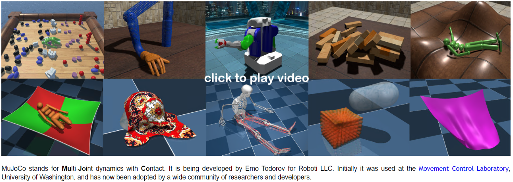
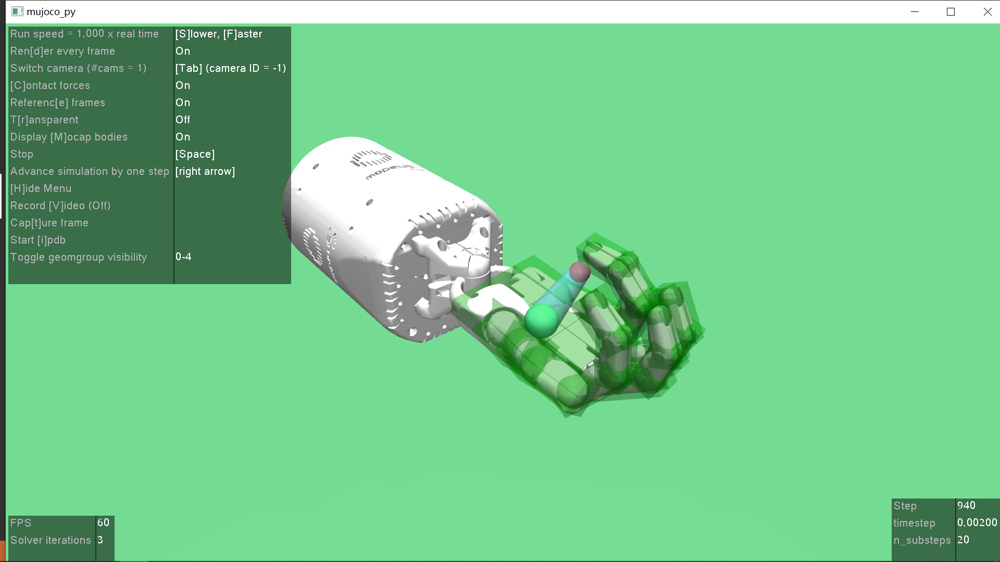

**Status:** Maintenance (expect bug fixes and minor updates)

# mujoco-py [](https://openai.github.io/mujoco-py/build/html/index.html) [](https://travis-ci.org/openai/mujoco-py)

[MuJoCo](http://mujoco.org/) is a physics engine for detailed, efficient rigid body simulations with contacts.

`mujoco-py` allows using MuJoCo from Python 3. This library has been updated to be compatible with MuJoCo version 2.0 released on 10/1/2018.

It has been used in many well-known research projects, such as:
- [gym](https://gym.openai.com/envs/#mujoco) RL platform created by OpenAI; 
- [ppdm](https://github.com/google-research/pddm) a In-hand manipulations algrithom created by Google Brain; 
- DeepMind's [dm_control](https://github.com/deepmind/dm_control/tree/master/dm_control/locomotion) and [rodent control](https://openreview.net/forum?id=SyxrxR4KPS);
- [Mujoco Haptix](http://www.mujoco.org/book/haptix.html) , a glove-based system only runs on Windows, mujoco150 up to now. 

## Windows Adaption 2023

- download mjc200 from https://www.roboti.us/download.html
- Everyone key: https://www.roboti.us/file/mjkey.txt
- clone this repo
- Activate CMD and set env with `os`: 
```
activate XXX
cd mujoco-py
pip install -e .
python
>>> import os
>>> os.environ["MUJOCO_PY_MUJOCO_PATH"] = r"D:\zzm_codes\codes2023\mujoco200_win64" # abs dir
>>> os.environ["MUJOCO_PY_MJKEY_PATH"] = os.environ["MUJOCO_PY_MUJOCO_PATH"] + "/mjkey.txt"
>>> mjcpy_bin = os.environ["MUJOCO_PY_MUJOCO_PATH"]+"\\bin"
>>> os.environ["PATH"] += ";" + mjcpy_bin
>>> os.add_dll_directory(mjcpy_bin) # for mujoco_py in py38
>>> import gym # 0.21.0
>>> env=gym.make('HandManipulatePenTouchSensorsDense-v0')
>>> exit()
```


## Windows Adaption 2020
Following the [issues#504](https://github.com/openai/mujoco-py/issues/504), this repo adapt the latest version of mujoco python wrapper to the windows environment correctly. 
The following demo is the gym env `env = gym.make('HandManipulatePenTouchSensorsDense-v0')`. 


### Pre-Conditions
One should firstly apply a valid mujoco license in [the license page](https://www.roboti.us/license.html) and received a file called `mjkey.txt`.Then you could download this C/C++ API in [the index page](https://www.roboti.us/index.html). 
After all these works, you could navigate to `mujoco\mujoco200\bin` directory with the `mjkey.txt` copied in, and run the commands like： 

01. **simulate 仿真xml定义的场景** Usage: use glfw to view the results:
```
simulate ../model/humanoid.xml
simulate ../model/hello.xml
```


02. **compile 模型转换** Usage: compile infile outfile
```
infile can be in mjcf, urdf, mjb format
outfile can be in mjcf, mjb, txt format
```

This is the base usage of Mujoco. For dive-into demo, please check the `\sample` directory.
 
### Environment Variable Settings

Here is my specific settings table. 

| Name |                    Variable | Description | 
|------|-----------------------------|-----------|
| MUJOCO_PY_MUJOCO_PATH | D:\Libraries\mujoco\mujoco200 | The dir contain mjc's bin, include, etc. |
|MUJOCO_PY_MJKEY_PATH | D:\Libraries\mujoco\utils\mjkey.txt | The abs path of the mjkey | 
| PATH | += D:\Libraries\mujoco\mujoco200\bin; $(where cl) | needed by cl.exe; for lib and dll | 
|INCLUDE | D:\Libraries\mujoco\mujoco200\include | needed by cl.exe;for header files |  


### Python Wrapper Creation
After the two above-mentioned Settings, you can create a anaconda environment with these configurations: 
- Windows 10
- Anaconda Python 3.7.6
- Mujoco200

And what will be created by this repo is: 
- mujoco-py 2.0.2.9

```
conda create -n gym37 python=3.7
git clone https://gitee.com/TneitaP/mujoco-py.git
cd mujoco-py
activate gym37
pip install -e .
python
>> import mujoco_py as mjc # for generation
>> exit()
pip install gym
```


## Credits

`mujoco-py` is maintained by the OpenAI Robotics team. Contributors include:

- Alex Ray
- Bob McGrew
- Jonas Schneider
- Jonathan Ho
- Peter Welinder
- Wojciech Zaremba
- Jerry Tworek
